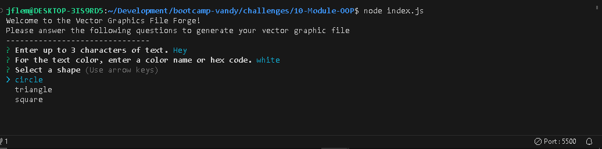
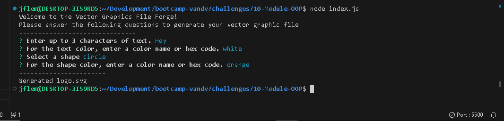
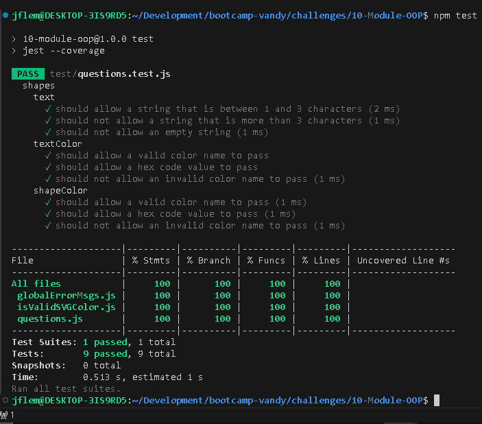

# Vector Graphics File Forge
  
  ## Description
  This app allow the user to generate an SVG vector graphic file.  
  The user simply answers a few prompt questions, and a beautiful graphic is generated based on the answers.
  ## Table of Contents

  1. [Installation](#Installation)
  2. [Usage](#Usage)
  3. [Testing](#Testing)
  4. [License](#License)
  5. [Questions](#Questions)

  ## Installaion
  This app can be used by forking the gitHub repository and cloning it to the user's local machine. 
  The repository for this app can be found [here](https://github.com/JFleming963/Vector-Graphics-File-Forge).  
  Then, from within the project directory the user must run `npm install` to download the necessary node modules.
  ## Usage
  To start the app, run `node index.js`.
   
  Next, the a series of questions will be prompted in the console.
  
  After the user answers the questions, a svg file named `logo.svg` will be saved into the subfolder `examples`.

  Then, simply open the newly created file in the web browser to see the results.

  
 
 
 
  ***
  A video walk-through can be found at this link: 
  [Video Walk-through](https://1drv.ms/v/s!AjeLyEZcQH2bsBGRmNtbJwYQcaWQ)

  ## Testing

  This app can be tested using the Jest testing framework.  
  To test the code, run `npm test` in the cli.  

  

  ## License
  This software uses the MIT License.
  ## Questions
  To see more projects or to contribute, please visit [My GitHub Profile](https://github.com/JFleming963).
